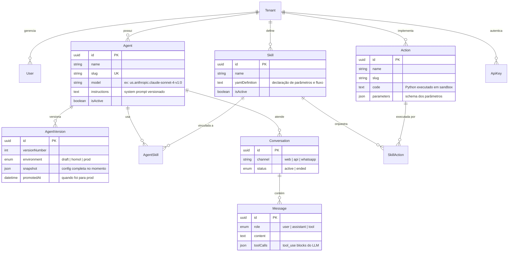

<p align="center">
  
</p>

<p align="center">
  
  
  
  
  
  
  
</p>

---

## Visão Geral

O **Banco Ágil** é uma plataforma de atendimento bancário baseada em agentes de inteligência artificial especializados. Cada agente possui um domínio de competência específico (câmbio, crédito, entrevista de crédito) e opera de forma autônoma dentro do seu escopo, sendo orquestrado por um agente de triagem que classifica a intenção do cliente e direciona para o especialista adequado.

A plataforma permite que operadores do banco configurem, testem e versionem os agentes via um portal administrativo, sem necessidade de código. O sistema de versionamento garante que alterações em prompts passem por um ciclo de draft → teste → promoção a produção, eliminando riscos de mudanças acidentais no atendimento.

### Principais capacidades

- **Multi-agente com roteamento inteligente**: Triagem automática por intenção, com redirecionamento transparente entre agentes
- **Execução sandboxed de ações**: Actions escritas em Python executam em RestrictedPython, sem acesso a filesystem ou rede
- **Versionamento de prompts**: Ciclo draft/produção com histórico completo e rollback
- **Skills compostas**: Agentes possuem skills declarativas (YAML) que orquestram actions (Python), permitindo composição modular
- **Playground integrado**: Teste de agentes em tempo real antes de promover para produção
- **LLM Gateway multi-provider**: Circuit breaker, rate limiting e fallback automático entre providers

---

## Arquitetura do Sistema

### Visão geral da infraestrutura

<p align="center">
  
</p>

### Agentes e fluxo de roteamento

O sistema opera com uma arquitetura multi-agente onde cada agente é um especialista isolado:

<p align="center">
  
</p>

| Agente | Slug | Responsabilidade | Skills |
|---|---|---|---|
| **Triagem** | `triagem` | Classifica intenção do cliente e redireciona para o especialista correto. Nunca responde diretamente — sempre encaminha. | `transferir_atendimento` |
| **Câmbio** | `cambio` | Consulta cotações de moedas em tempo real (dólar, euro, bitcoin, etc). Apresenta compra/venda/variação. | `consultar_cotacao` |
| **Crédito** | `credito` | Consulta score de crédito e calcula limites disponíveis para o cliente. | `verificar_score`, `calcular_limite` |
| **Entrevista** | `entrevista` | Conduz entrevista estruturada para reavaliação de perfil creditício. Coleta dados e recalcula score. | `avaliar_perfil` |

### Fluxo de dados de uma conversa

<p align="center">
  
</p>

### Modelo de dados



---

## Funcionalidades Implementadas

### Portal Administrativo
- **CRUD de Agentes**: criar, editar, ativar/desativar agentes com model e system prompt configuráveis
- **Versionamento de prompts**: sistema draft/produção — edições salvam como rascunho, promoção aplica em produção
- **Histórico de versões**: visualização de todas as versões com diff de instruções, autor e timestamp
- **Rollback**: reverter para qualquer versão anterior do prompt
- **Playground**: chat em tempo real com o agente (usa o draft, não a produção)
- **Skills e Actions**: criação de skills declarativas (YAML) e actions (Python) com editor Monaco integrado
- **Vinculação Skill ↔ Agent**: interface para vincular/desvincular skills dos agentes com prioridade configurável

### Motor de Conversação (Agent Runtime)
- **Orquestração LLM**: monta prompt com system instructions + tool definitions + conversation history
- **Tool calling**: recebe `tool_use` do LLM, executa a action correspondente em sandbox, retorna resultado
- **Roteamento entre agentes**: tool especial `transferir_atendimento` troca o agente ativo na conversa
- **Streaming SSE**: resposta token-a-token em tempo real via Server-Sent Events
- **Guardrails**: filtro de conteúdo configurável por agente
- **Hot reload**: recarrega config do agente sem restart do container

### Conversation API
- **REST completa**: CRUD de conversas e mensagens
- **Upload de arquivos**: anexos armazenados no S3
- **Rate limiting**: por API key, por tenant
- **API key authentication**: chaves com scopes e rate limits configuráveis

### LLM Gateway
- **Multi-provider**: Bedrock, OpenAI, Azure OpenAI, Gemini — com lazy loading de SDKs
- **Circuit breaker**: detecta falhas consecutivas e desvia para provider alternativo
- **Rate limiter**: controle por tenant e por modelo
- **Cost tracking**: estimativa de custo por request baseada em token count
- **Response caching**: cache configurável para respostas determinísticas
- **Load balancer**: round-robin, weighted e latency-based

### Infraestrutura
- **AWS CDK**: stack completa (VPC, ECS Fargate, RDS, S3, Secrets Manager, CloudWatch)
- **Cloudflare Tunnel**: ingress zero-trust sem ALB público exposto
- **CI/CD**: GitHub Actions com build, push ECR e rolling update no ECS
- **Fast deploy**: workflow otimizado (~3-5min) que pula CDK quando só código mudou

---

## Desafios Enfrentados e Como Foram Resolvidos

### 1. Versionamento de prompts sem afetar produção

**Problema**: Editar o prompt de um agente aplicava a mudança imediatamente em produção, sem possibilidade de teste prévio. Qualquer erro de digitação ou prompt mal formulado impactava clientes em tempo real.

**Solução**: Implementamos um sistema de draft/produção inspirado em CMS headless. Ao salvar, as alterações vão para uma `AgentVersion` com `environment: "draft"`. O agente live continua usando a versão `prod`. O operador testa no playground (que usa o draft) e só quando satisfeito, promove — o que copia o snapshot para o registro do Agent e marca a versão como `prod`. Versões anteriores ficam como `homol` para rollback.

### 2. Execução segura de código Python arbitrário

**Problema**: Actions dos agentes são scripts Python escritos por operadores do banco. Executar código arbitrário no servidor é um risco crítico de segurança.

**Solução**: Usamos RestrictedPython, que compila o código em um AST restrito antes de executar. O sandbox não tem acesso a `import`, filesystem, rede ou variáveis globais. A action recebe apenas os parâmetros declarados e um SDK controlado (`sdk.http_get`, `sdk.store_result`) que limita as operações possíveis. Timeouts de 5 segundos previnem loops infinitos.

### 3. Roteamento transparente entre agentes

**Problema**: Quando o cliente pede algo fora do escopo do agente atual (ex: pede crédito ao agente de câmbio), a experiência não pode quebrar — o redirecionamento precisa ser suave.

**Solução**: Cada agente tem em seu prompt uma seção `ENCAMINHAMENTO` com mapeamento de intenções para agentes-alvo. O LLM chama a tool `transferir_atendimento` com o nome do agente destino. O runtime troca o agente ativo na conversa e reinicia o fluxo com o novo agente, mantendo o histórico. O cliente percebe apenas uma transição natural.

### 4. Custo de infraestrutura para um produto em validação

**Problema**: AWS pode ser cara para um MVP. Precisávamos de uma arquitetura produção-ready sem estourar o budget.

**Solução**: Arquitetura monolítica inteligente — em vez de 5 containers separados, o backend roda agent-runtime + conversation-api no mesmo container via supervisord, com Nginx como proxy interno. Isso permite usar uma única task ECS Fargate (0.5 vCPU / 1GB) em vez de cinco. Redis desabilitado (usa memória). Cloudflare Tunnel no free tier elimina o ALB ($18/mês). Custo total: ~$40/mês.

### 5. Consistência entre frontend Prisma e backend SQLAlchemy

**Problema**: O portal (TypeScript) usa Prisma ORM e o backend (Python) usa SQLAlchemy, ambos acessando o mesmo banco. Mudanças de schema precisam funcionar nos dois.

**Solução**: O Prisma é a fonte de verdade para o schema (DDL). O SQLAlchemy usa modelos espelhados no package `db-schema`, com Alembic para migrações incrementais. Em desenvolvimento, `prisma db push` aplica o schema; em produção, Alembic gerencia as migrações. O `docker-entrypoint.sh` do portal roda `prisma migrate deploy` automaticamente no boot.

---

## Escolhas Técnicas e Justificativas

### Linguagens e Frameworks

| Escolha | Justificativa |
|---|---|
| **Next.js 14 (App Router)** | Server Components reduzem JS no cliente. Server Actions eliminam a necessidade de API routes para mutações. Ideal para painéis administrativos data-heavy. |
| **FastAPI (Python)** | Async nativo, tipagem com Pydantic, documentação automática. Ecossistema Python é essencial para integração com SDKs de LLM. |
| **Prisma (TypeScript ORM)** | Type-safe queries, migrations declarativas, multi-schema support. Gera client tipado automaticamente. |
| **SQLAlchemy (Python ORM)** | Maduro, flexível, usado pelo ecossistema Python. Alembic para migrações programáticas. |

### Infraestrutura

| Escolha | Alternativa considerada | Justificativa |
|---|---|---|
| **ECS Fargate** | EKS, Lambda | Fargate: sem gerenciamento de servidores, pricing por segundo, mais simples que Kubernetes. Lambda não suporta streaming SSE longo. |
| **Monolith (supervisord)** | Microservices separados | Em fase de validação, monolito reduz custo (1 task vs 5) e complexidade operacional. Código já é modular — migrar para microservices é trocar o Dockerfile. |
| **Cloudflare Tunnel** | ALB + ACM + Route53 | Zero-trust por padrão, sem ALB ($18/mês), SSL automático, DDoS incluído. Trade-off: dependência do Cloudflare. |
| **PostgreSQL + pgvector** | DynamoDB, MongoDB | Relacional para dados transacionais (tenants, agents, conversations). pgvector para busca semântica (RAG) no mesmo banco, sem serviço adicional. |
| **AWS CDK (TypeScript)** | Terraform, CloudFormation | CDK permite lógica de programação real (loops, condicionais), tipagem forte, e gera CloudFormation automaticamente. |

### Arquitetura de Agentes

| Escolha | Justificativa |
|---|---|
| **Skills declarativas (YAML)** | Operadores do banco configuram sem código. YAML define parâmetros, descrição e actions vinculadas. O runtime converte para tool definitions do LLM automaticamente. |
| **Actions em Python sandboxed** | Flexibilidade máxima com segurança. RestrictedPython permite lógica arbitrária (cálculos, transformações) sem expor o servidor. |
| **Roteamento por tool_use** | Mais natural que regex ou classificador separado. O LLM decide quando redirecionar baseado no contexto da conversa, não em regras rígidas. |
| **Streaming SSE** | Experiência de chat real-time. O cliente vê tokens sendo gerados, reduzindo a percepção de latência (time-to-first-token ~300ms). |

### LLM Gateway próprio vs LiteLLM/LangChain

Optamos por um gateway próprio (`agil_llm_gateway`) em vez de usar LiteLLM ou LangChain Router porque:

1. **Controle total** sobre circuit breaking, fallback e rate limiting — sem depender de release cycles de terceiros
2. **Lazy loading de SDKs** — só carrega o SDK do provider que está em uso (Bedrock, OpenAI, etc), reduzindo memory footprint
3. **Cost tracking integrado** — estimativa de custo por request com tabela de preços embutida
4. **Zero dependências opinativas** — não força patterns como chains, memory ou agents do LangChain

---

## Tutorial de Execução e Testes

### Pré-requisitos

- Docker + Docker Compose v2
- Node.js 22+ (para desenvolvimento do portal)
- Python 3.12+ (para desenvolvimento dos backends)
- AWS CLI v2 (para deploy em produção)

### 1. Clone o repositório

```bash
git clone https://github.com/dressacl/desafio-bancoagil.git
```

### 2. Configure as variáveis de ambiente

```bash
cp .env.example .env
# Edite .env — para dev local, os defaults já funcionam
```

### 3. Suba o ambiente com Docker Compose

```bash
docker compose up -d
```

Isso sobe:
- **PostgreSQL 16** (pgvector) na porta 5432
- **Redis 7** na porta 6379
- **Backend** (agent-runtime + conversation-api) na porta 8000
- **Portal** (Next.js) na porta 3000

### 4. Inicialize o banco de dados

```bash
# Aplica o schema do Prisma
cd apps/portal
npm install
npx prisma db push

# Cria o tenant e usuário admin
cd ../..
docker compose exec postgres psql -U agilbanco -d agilbanco \
  -c "$(cat scripts/create-tenant-user.sql)"
```

### 5. Acesse o portal

- **URL**: http://localhost:3000

#### Usuários de teste

| Usuário | Email | Senha | Role | Descrição |
|---|---|---|---|---|
| Admin | admin@agilbanco.com.br | ********* | admin | Acesso total — gerencia agentes, skills, actions e versões |
| Operador | operador@agilbanco.com.br | ********* | operator | Edita agentes e testa no playground, sem acesso a configurações |
| Viewer | viewer@agilbanco.com.br | ********* | viewer | Somente leitura — visualiza agentes e histórico de versões |

### 6. Teste um agente

1. No portal, acesse **Agentes** → **Agente de Câmbio**
2. Clique na aba **Playground**
3. Digite: "Qual a cotação do dólar?"
4. O agente executa a skill `consultar_cotacao` e retorna a cotação

### 7. Teste o versionamento

1. No portal, acesse **Agentes** → **Agente de Câmbio** → aba **Configuração**
2. Edite o system prompt (ex: adicione uma linha)
3. Clique **Salvar Rascunho** — observe o toast "Rascunho salvo"
4. Abra **Ver histórico de versões** — o draft aparece com timestamp atualizado
5. Teste no Playground (usa o draft)
6. Clique **Promover** para enviar para produção

### 8. Teste via API

```bash
# Health check
curl http://localhost:8000/health

# Criar conversa (requer API key configurada)
curl -X POST http://localhost:8001/api/conversations \
  -H "Content-Type: application/json" \
  -H "X-API-Key: sua-api-key" \
  -d '{"agentSlug": "cambio"}'
```

### Deploy em produção (AWS)

#### Pré-requisitos AWS

1. Conta AWS com perfil configurado (ex: `andressa`)
2. AWS CDK bootstrapped na região (`npx cdk bootstrap`)
3. Cloudflare Tunnel criado e token salvo no SSM (`/tenant/agilbanco/cloudflare-tunnel-token`)

#### 9. Provisionar infraestrutura (primeira vez)

```bash
cd infra/cdk
npm install

# Deploy da stack completa: VPC, RDS, ECS, S3, IAM, CloudWatch
npx cdk deploy --context mode=tenant-isolated \
  --context tenantName=AgilBanco \
  --context tenantSlug=agilbanco \
  --context vpcCidr=10.20.0.0/16 \
  --profile andressa
```

Isso cria:
- VPC com 2 AZs (public + isolated subnets, sem NAT)
- RDS PostgreSQL 16 (db.t4g.micro, 20GB, Secrets Manager)
- ECS Fargate Cluster com 2 tasks (portal + backend)
- S3 bucket para arquivos
- ECR repos para as imagens Docker
- IAM roles com acesso ao Bedrock
- CloudWatch log groups

#### 10. Build e deploy das imagens

```bash
# Login no ECR
ACCOUNT_ID=$(aws sts get-caller-identity --query Account --output text --profile andressa)
REGION=us-east-1
aws ecr get-login-password --region $REGION --profile andressa | \
  docker login --username AWS --password-stdin ${ACCOUNT_ID}.dkr.ecr.${REGION}.amazonaws.com

# Build e push do backend
docker build -f apps/backend/Dockerfile -t ${ACCOUNT_ID}.dkr.ecr.${REGION}.amazonaws.com/agilbanco/backend:latest .
docker push ${ACCOUNT_ID}.dkr.ecr.${REGION}.amazonaws.com/agilbanco/backend:latest

# Build e push do portal
docker build -f apps/portal/Dockerfile -t ${ACCOUNT_ID}.dkr.ecr.${REGION}.amazonaws.com/agilbanco/portal:latest .
docker push ${ACCOUNT_ID}.dkr.ecr.${REGION}.amazonaws.com/agilbanco/portal:latest
```

#### 11. Force new deployment no ECS

```bash
CLUSTER=$(aws ecs list-clusters --query "clusterArns[?contains(@,'AgilBanco')]|[0]" \
  --output text --region $REGION --profile andressa)

# Atualiza todos os serviços com as novas imagens
for svc in $(aws ecs list-services --cluster "$CLUSTER" --profile andressa --region $REGION \
  --query 'serviceArns[*]' --output text | tr '\t' '\n' | xargs -I{} basename {}); do
  echo "Updating $svc..."
  aws ecs update-service --cluster "$CLUSTER" --service "$svc" \
    --force-new-deployment --profile andressa --region $REGION --output text
done

# Aguardar estabilização (~2-3 minutos)
aws ecs wait services-stable --cluster "$CLUSTER" --services $(aws ecs list-services \
  --cluster "$CLUSTER" --profile andressa --region $REGION \
  --query 'serviceArns[*]' --output text | tr '\t' '\n' | xargs -I{} basename {}) \
  --profile andressa --region $REGION
```

#### 12. Acesse o portal em produção

- **URL**: https://agilbanco.com.br (via Cloudflare Tunnel)
- **API**: https://api.agilbanco.com.br

Os mesmos [usuários de teste](#usuários-de-teste) funcionam tanto no ambiente local quanto em produção.

#### Deploy automatizado (CI/CD)

O push para `main` dispara o workflow `deploy.yml` automaticamente. Para deploys manuais:

```bash
# Via GitHub Actions — deploy completo
gh workflow run deploy.yml -f stage=dev

# Via GitHub Actions — fast deploy (só containers, sem CDK, ~3-5min)
gh workflow run fast-deploy.yml -f stage=dev -f skip_portal=false

# Via script local
./scripts/deploy.sh dev
```

---

## Estrutura do Repositório

```
agilbanco-platform/
├── apps/
│   ├── portal/                     # Next.js 14 — Interface administrativa
│   │   ├── src/
│   │   │   ├── app/                # App Router (pages + API routes)
│   │   │   │   ├── (auth)/         # Login, autenticação
│   │   │   │   ├── (portal)/       # Páginas protegidas
│   │   │   │   │   ├── agents/     # CRUD de agentes + playground + versões
│   │   │   │   │   ├── skills/     # CRUD de skills
│   │   │   │   │   └── actions/    # CRUD de actions
│   │   │   │   ��── api/            # Route handlers (auth, chat, test-data)
│   │   │   ├── components/
│   │   │   │   ├── agents/         # AgentForm, ModelPicker, SkillLinker, VersionTable
│   │   │   │   ├── skills/         # SkillForm, ActionLinker
│   │   │   │   ├── actions/        # ActionForm, ParametersBuilder
│   │   │   │   ├── layout/         # Sidebar, Header, BankLogo
│   │   │   │   ├── shared/         # DataTable, ConfirmDialog, DetailTabs
│   │   │   │   ├── editors/        # Monaco code editor
│   │   │   │   └��─ ui/             # 23 componentes shadcn/ui
│   │   │   └── lib/                # Auth, Prisma, i18n, backend client
│   │   ├── prisma/schema.prisma    # Schema do banco (3 schemas: admin, runtime, knowledge)
│   │   └── Dockerfile
│   │
│   ├── backend/                    # Container monolítico (supervisord + nginx)
│   │   ├── Dockerfile              # Bundla agent-runtime + conversation-api
│   │   ├── nginx.conf              # Reverse proxy :8000 → :8010/:8011
│   │   └── supervisord.conf        # Gerencia processos internos
│   │
│   ├── agent-runtime/              # FastAPI — Motor de conversação e LLM
│   │   └── src/
│   │       ├── core/               # runtime.py, llm_caller.py, guardrails.py, skill_parser.py
│   │       ├── sandbox/            # executor.py (RestrictedPython), sdk.py, validators.py
│   │       ├── services/           # agent_config.py, conversation.py, webhook.py
│   │       └── api/                # engine.py (chat endpoint), health.py, internal.py
│   │
│   └── conversation-api/           # FastAPI — REST API de conversas
���       └── src/
│           ├── api/                # conversations.py, files.py, health.py
│           ├── auth/               # api_key.py (validação de chaves)
│           └── middleware/         # rate_limit.py
│
├── packages/
│   ├── llm-gateway/                # Gateway LLM multi-provider
│   │   ├── agil_llm_gateway/       # Core: gateway.py, circuit_breaker.py, rate_limiter.py, cache.py
│   │   │   └── providers/          # bedrock.py, openai_provider.py, azure_openai.py, gemini.py
│   │   └── tests/                  # Suite de testes do gateway
│   │
│   ├── db-schema/                  # SQLAlchemy models + Alembic migrations
│   │   ├── src/db_schema/          # admin.py, runtime.py, knowledge.py
│   │   └── alembic/                # Migrações incrementais
│   │
│   └── shared/                     # Utilitários Python compartilhados
│       └── src/shared/             # config.py, logging.py, redis_client.py, s3_client.py
│
├── infra/cdk/                      # AWS CDK — Infrastructure as Code
│   ├── tenant-isolated-stack.ts    # Stack completa (VPC, ECS, RDS, S3, IAM)
│   └── config.ts                   # Configuração por ambiente (dev/prod)
│
├── scripts/
│   ├── deploy.sh                   # Deploy completo (build → ECR → CDK → ECS)
│   ├── provision-tenant.sh         # Provisionamento de novo tenant
���   └── create-tenant-user.sql      # SQL para criação do tenant + admin
│
├── .github/workflows/
│   ├── deploy.yml                  # CI/CD: build → push ECR → rolling update
│   └── fast-deploy.yml             # Deploy rápido (~3-5min, sem CDK)
│
├── docker-compose.yml              # Ambiente de desenvolvimento local
├── .env.example                    # Template de variáveis de ambiente
└── README.md
```
