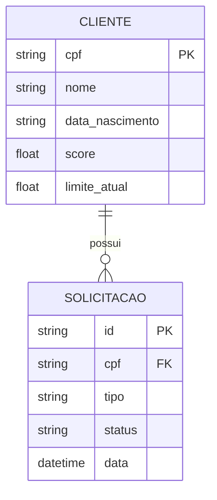

  

  
  
  
  
  
  

---

## 1. Visão Geral
O **Banco Ágil** redefine a experiência de autoatendimento bancário através de uma **Arquitetura Multi-Agente**. Ao contrário de chatbots tradicionais baseados em árvores de decisão rígidas ou palavras-chave, este sistema utiliza agentes de IA com raciocínio autônomo (ReAct) que operam sob um grafo de estados orquestrado pelo **LangGraph**.

Cada agente é um especialista em seu domínio (Câmbio, Crédito, Entrevista), capaz de processar intenções complexas e executar ferramentas (tools) para resolver problemas reais do cliente em tempo real.

---

## 2. Arquitetura de Agentes (The Brain)
A escolha da stack foi guiada pela necessidade de **comportamento dinâmico e memória persistente**.

### Visão Geral da Arquitetura

  

### Por que LangGraph?
Em fluxos bancários, o cliente raramente segue uma linha reta. Ele pode perguntar sobre o dólar enquanto faz um pedido de crédito. O LangGraph nos permite criar **grafos cíclicos**, onde os agentes podem transferir o controle entre si ou retornar ao menu principal sem perder o contexto da sessão (State Management), algo que seria impossível com cadeias lineares simples (DAGs).

### O Padrão ReAct (Reasoning + Acting)
Nossos agentes não apenas respondem texto; eles **agem**.
1. **Reasoning**: O agente analisa a fala do usuário e decide se precisa de informações adicionais ou se deve usar uma ferramenta.
2. **Acting**: Ele chama ferramentas como `consultar_limite` ou `atualizar_score` de forma autônoma.
3. **Observation**: O agente lê o resultado da ferramenta e formula uma resposta natural para o cliente.

  

---

## 3. Fluxo de Especialistas
- **Triagem (`triagem`)**: Gerencia o protocolo de segurança (autenticação MFA) e atua como o roteador inteligente do sistema.
- **Crédito (`credito`)**: Possui permissão para consultar o motor de crédito e solicitar aumentos de limite.
- **Entrevista de Crédito (`entrevista`)**: Um agente consultivo que realiza uma análise profunda do perfil socioeconômico para recalcular o score.
- **Câmbio (`cambio`)**: Especialista em moedas, integrado a cotações em tempo real.

### Modelo de Dados (Relacional)

---

## 4. Escolhas Técnicas e Justificativas
- **FastAPI (Streaming SSE)**: Para garantir que a resposta da IA pareça fluída, utilizamos streaming de eventos. Isso reduz a percepção de latência, entregando a resposta palavra por palavra.
- **Supabase**: Escolhido para ser a "fonte da verdade" (Source of Truth). Ele armazena não apenas os perfis, mas também o estado persistente das conversas, permitindo auditoria e continuidade.
- **Temperature Control (0.0)**: Priorizamos a **confiabilidade**. Todos os modelos são configurados com temperatura zero para eliminar alucinações em cálculos financeiros e garantir que as regras de crédito sejam seguidas à risca.

---

## 5. Desafios de Engenharia e Soluções
- **Gestão de Contexto Dinâmico**: Conversas longas podem estourar a janela de contexto. Desenvolvemos um mecanismo de `trim_messages` que condensa o histórico, mantendo apenas o essencial para a tomada de decisão.
- **Resiliência de Identidade**: Resolvemos o desafio da perda de contexto do CPF através da injeção dinâmica de metadados em cada turno de conversação, garantindo que o agente nunca "esqueça" com quem está falando, mesmo após longas entrevistas.

---

## 6. Como Executar

### Backend
1. Instale as dependências: `pip install -r requirements.txt`
2. Configure o `.env` com suas chaves (OpenRouter, Gemini ou OpenAI).
3. Inicie o servidor: `uvicorn api.main:app --reload`

### Frontend
1. Instale as dependências: `npm install`
2. Inicie o ambiente de desenvolvimento: `npm run dev`

---
*Desenvolvido como uma prova de conceito de sistemas agenticos avançados.*
