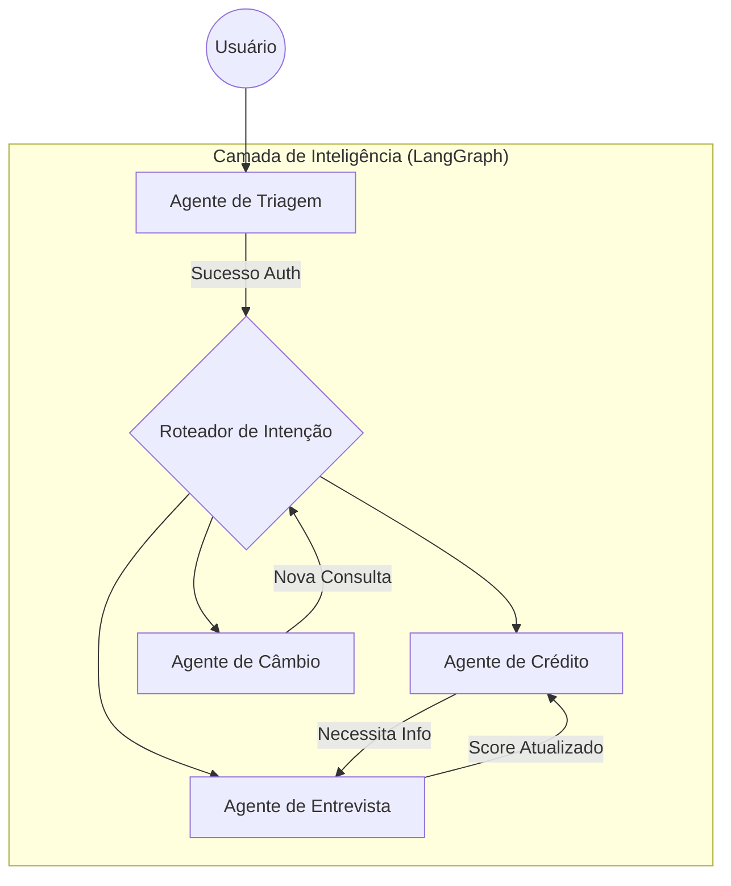

<p align="center">
  
</p>

<p align="center">
  
  
  
  
  
  
</p>

---

## Visão Geral

O **Banco Ágil** é uma plataforma de atendimento bancário baseada em **agentes de inteligência artificial especializados**. Cada agente possui um domínio de competência específico (câmbio, crédito, entrevista de crédito) e opera de forma autônoma dentro do seu escopo, sendo orquestrado por um grafo de estados que classifica a intenção do cliente e direciona para o especialista adequado.

A plataforma permite uma interação fluida onde o usuário pode consultar limites, solicitar aumentos e obter cotações de moedas em tempo real, tudo através de uma interface de chat premium que simula um atendimento de concierge digital.

### Principais capacidades

- **Multi-agente com roteamento inteligente**: Triagem automática por intenção via LangGraph, com redirecionamento transparente entre agentes especialista.
- **Memória de Curto e Longo Prazo**: Persistência de contexto da conversa via checkpointers do LangGraph.
- **Cálculo de Score Dinâmico**: Algoritmo que processa dados financeiros coletados durante a entrevista para atualizar o perfil de crédito.
- **LLM Gateway Multi-provider**: Suporte configurável para Groq, Google Gemini, OpenAI e OpenRouter (MiniMax).
- **Interface Dual**: Backend que serve tanto uma aplicação moderna em React quanto uma interface administrativa em Streamlit.

---

## Arquitetura do Sistema

### Agentes e fluxo de roteamento

O sistema opera com uma arquitetura multi-agente onde cada nó do grafo é um especialista isolado:

| Agente | Slug | Responsabilidade | Ferramentas |
|---|---|---|---|
| **Triagem** | `triagem` | Boas-vindas e Autenticação. Valida o cliente e direciona para o serviço solicitado. | `validar_cpf`, `verificar_nascimento` |
| **Crédito** | `credito` | Consulta limites atuais e processa pedidos de aumento imediato. | `consultar_limite`, `solicitar_aumento` |
| **Entrevista** | `entrevista` | Conduz entrevista estruturada para coleta de dados financeiros e atualização de score. | `coletar_dados`, `atualizar_score` |
| **Câmbio** | `cambio` | Consulta cotações de moedas (USD, EUR, BTC) em tempo real via API externa. | `consultar_cotacao` |

### Fluxo de Decisão (Mermaid)



### Modelo de Dados (Persistência CSV)


---

## Funcionalidades Implementadas

### Motor de Conversação (Agent Runtime)
- **Orquestração LangGraph**: Grafo de estados cíclico que gerencia transições e estados de forma robusta.
- **Tool Calling Nativo**: Integração direta entre o LLM e as funções de negócio (services).
- **Handoff Transparente**: O sistema troca o agente ativo na conversa mantendo o histórico completo.
- **Streaming SSE**: Respostas token-a-token no frontend para redução da latência percebida.
- **Sistema de Checkpoints**: Capacidade de retomar conversas de onde pararam.

### Interface do Usuário (Frontend)
- **Chat Estilo Concierge**: Design minimalista focado em experiência premium.
- **Feedback de Digitação**: Indicadores visuais de que o agente está processando a informação.
- **Validação de Formulários**: Input de CPF e datas com validação em tempo real via Zod.
- **Responsividade Total**: Interface otimizada para mobile e desktop.

### Conversation API (FastAPI)
- **Endpoints REST**: `/chat` para interações síncronas e `/chat/stream` para streaming SSE.
- **Health Checks**: Endpoint `/health` para monitoramento do status do serviço.
- **Middleware CORS**: Configurado para comunicação segura entre frontend e backend.

---

## Escolhas Técnicas e Justificativas

### Linguagens e Frameworks

| Escolha | Justificativa |
|---|---|
| **Vite + React (TS)** | Entrega uma interface extremamente rápida e tipada, essencial para componentes complexos de chat. |
| **FastAPI (Python)** | O padrão ouro para APIs de IA em Python, oferecendo suporte assíncrono nativo para streaming. |
| **LangGraph** | Supera cadeias lineares (LangChain) ao permitir loops e lógica de decisão complexa entre agentes. |
| **Shadcn/UI** | Componentes de alta qualidade que garantem a estética "premium" com baixo custo de manutenção. |

### Persistência e Integrações

| Escolha | Justificativa |
|---|---|
| **CSV / Pandas** | Permite auditoria imediata dos dados de teste sem necessidade de subir um servidor de banco de dados. |
| **AwesomeAPI** | Fonte confiável e gratuita para cotações de câmbio em tempo real. |
| **Multi-Provider LLM** | Flexibilidade para usar Groq (velocidade), Google (janela de contexto) ou OpenRouter (diversidade de modelos). |

---

## Tutorial de Execução e Testes

### Pré-requisitos
- Python 3.10+
- Node.js 18+
- Chave de API de um provedor (Groq, OpenRouter ou Google)

### 1. Instalação

```bash
# Clone o repositório
git clone https://github.com/gusttavosants/BankChat.git
cd BankChat

# Setup Backend
cd backend
python -m venv .venv
source .venv/bin/activate # Windows: .venv\Scripts\activate
pip install -r requirements.txt

# Setup Frontend
cd ../frontend
npm install
```

### 2. Configuração do `.env`

Crie o arquivo `backend/.env`:
```ini
# API Keys
GROQ_API_KEY=gsk_...
OPENROUTER_API_KEY=sk-or-v1-...

# Configurações de LLM
LLM_PROVIDER=openrouter # groq | google | openrouter
MODEL_NAME=minimax/minimax-01 # ou llama-3.1-8b-instant
```

### 3. Execução

Você precisará de dois terminais abertos:

**Terminal 1 (Backend - API):**
```bash
cd backend
uvicorn api.main:app --reload --port 8000
```

**Terminal 2 (Frontend - Web):**
```bash
cd frontend
npm run dev
```

---

## Estrutura do Repositório

```text
banco-agil/
├── backend/                # API e Lógica de Agentes
│   ├── agents/             # Definição dos agentes LangGraph
│   ├── api/                # Servidor FastAPI (main.py)
│   ├── app/                # Interface Streamlit (Testes)
│   ├── core/               # Orquestração, Configuração e Estado
│   ├── repositories/       # Persistência de Dados (CSV)
│   ├── services/           # Regras de Negócio e APIs externas
│   └── tests/              # Suíte de Testes com Pytest
├── frontend/               # Aplicação Web (Vite + React)
│   ├── src/
│   │   ├── components/     # UI Components e Lógica de Chat
│   │   ├── hooks/          # Hooks de API e Estado
│   │   └── pages/          # Layouts Principais
│   └── package.json
└── README.md
```

---
*Desenvolvido por Gustavo Santos como parte do desafio técnico para Agente Bancário Inteligente.*
