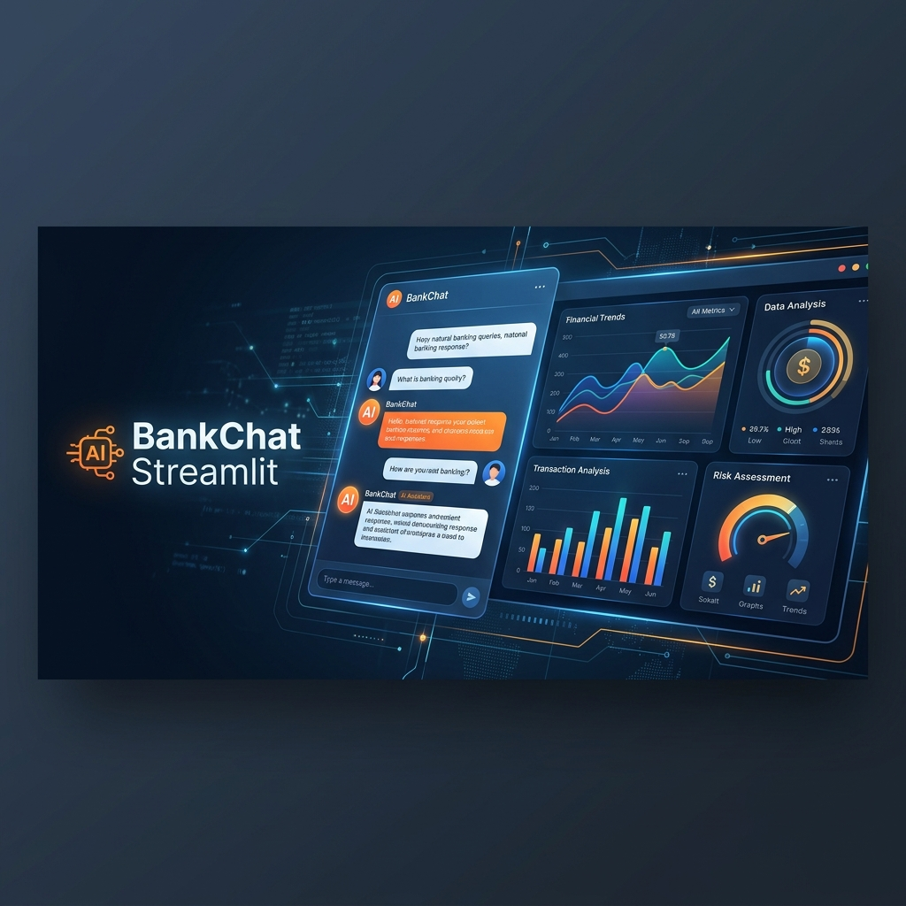
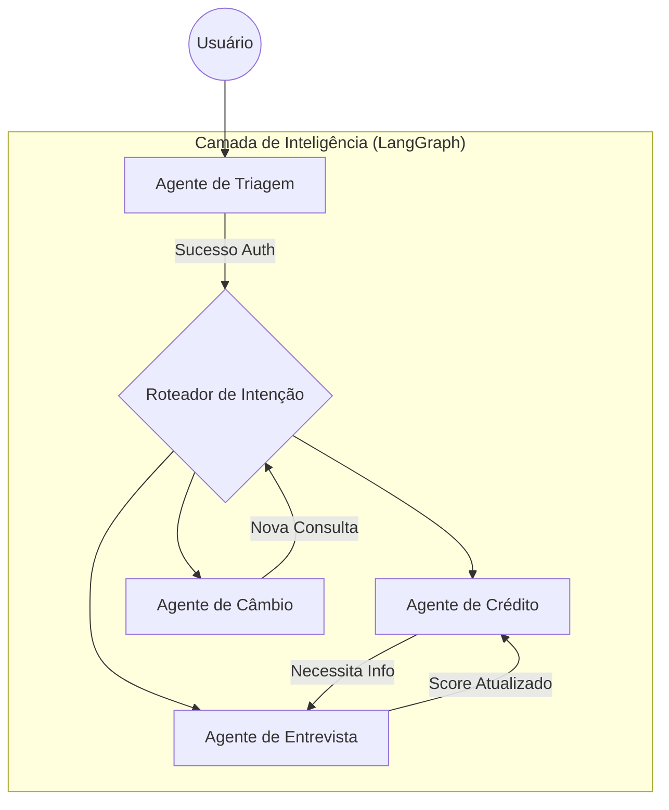

<p align="center">
  
</p>

<p align="center">
  
  
  
  
</p>

---

## Visão Geral (Versão Streamlit)

O **Banco Ágil** é uma plataforma de atendimento bancário baseada em **agentes de inteligência artificial especializados**. Esta versão utiliza o **Streamlit** para fornecer uma interface de chat rápida e funcional, focada em validação técnica, testes de lógica de agentes e prototipagem ágil.

Cada agente possui um domínio de competência específico (câmbio, crédito, entrevista de crédito) e opera de forma autônoma dentro do seu escopo, sendo orquestrado por um grafo de estados (LangGraph) que classifica a intenção do cliente e direciona para o especialista adequado.

### Principais capacidades

- **Interface de Prototipagem Rápida**: Chat interativo desenvolvido em Streamlit para visualização imediata do comportamento dos agentes.
- **Multi-agente com roteamento inteligente**: Triagem automática por intenção via LangGraph, com redirecionamento transparente entre agentes especialistas.
- **Memória de Curto Prazo**: Persistência de contexto da conversa durante a sessão.
- **Cálculo de Score Dinâmico**: Algoritmo que processa dados financeiros coletados durante a entrevista para atualizar o perfil de crédito.
- **LLM Gateway Multi-provider**: Suporte configurável para Groq, Google Gemini, OpenAI e OpenRouter.
- **Persistência em CSV**: Auditoria imediata dos dados de teste sem necessidade de subir um servidor de banco de dados complexo.

---

## Arquitetura do Sistema

### Visão Geral da Arquitetura

<p align="center">
  
</p>

### Fluxo de Agentes

<p align="center">
  
</p>

| Agente | Slug | Responsabilidade | Ferramentas |
|---|---|---|---|
| **Triagem** | `triagem` | Boas-vindas e Autenticação. Valida o cliente e direciona para o serviço solicitado. | `validar_cpf`, `verificar_nascimento` |
| **Crédito** | `credito` | Consulta limites atuais e processa pedidos de aumento imediato. | `consultar_limite`, `solicitar_aumento` |
| **Entrevista** | `entrevista` | Conduz entrevista estruturada para coleta de dados financeiros e atualização de score. | `coletar_dados`, `atualizar_score` |
| **Câmbio** | `cambio` | Consulta cotações de moedas (USD, EUR, BTC) em tempo real via API externa. | `consultar_cotacao` |

### Fluxo de Decisão (Graph)



---

## Funcionalidades Implementadas

### Motor de Conversação (Agent Runtime)
- **Orquestração LangGraph**: Grafo de estados que gerencia transições entre agentes de forma robusta.
- **Tool Calling Nativo**: Integração direta entre o LLM e as funções de negócio definidas no backend.
- **Handoff Transparente**: O sistema troca o agente ativo na conversa mantendo o histórico completo.
- **Processamento de CSV**: Leitura e escrita de dados de clientes e solicitações em tempo real via Pandas.

### Interface Streamlit
- **Chat Interface**: Chat amigável com suporte a markdown e formatação de texto.
- **Sidebar de Debug**: Visualização de estados internos e informações técnicas (se configurado).
- **Widgets de Resumo**: Exibição de dados do cliente após autenticação.

---

## Tutorial de Execução

### Pré-requisitos
- Python 3.10+
- Chave de API de um provedor (Groq, OpenRouter ou Google)

### 1. Instalação

```bash
# Clone o repositório
git clone https://github.com/gusttavosants/BankChat.git
cd BankChat

# Setup
cd backend
python -m venv .venv
source .venv/bin/activate # Windows: .venv\Scripts\activate
pip install -r requirements.txt
```

### 2. Configuração do `.env`

Crie o arquivo `backend/.env`:
```ini
# API Keys
GROQ_API_KEY=sua_chave_aqui
OPENROUTER_API_KEY=sua_chave_aqui

# Configurações de LLM
LLM_PROVIDER=openrouter # groq | google | openrouter
MODEL_NAME=minimax/minimax-01
```

### 3. Execução

Inicie a interface Streamlit diretamente:
```bash
cd backend
streamlit run app/streamlit_app.py
```

---

## Estrutura do Repositório

```text
banco-agil/
├── backend/                # Lógica Central e Agentes
│   ├── agents/             # Nós do LangGraph (Especialistas)
│   ├── app/                # Interface Streamlit (streamlit_app.py)
│   ├── core/               # Orquestração, Configuração e Estado
│   ├── data/               # Banco de dados em CSV (Clientes e Scores)
│   ├── repositories/       # Camada de Acesso a Dados (Pandas)
│   ├── services/           # Lógica de Negócio e APIs Externas
│   └── utils/              # Formatadores, Logs e Helpers
└── README.md
```

---
*Desenvolvido por Gustavo Santos como parte do protótipo Banco Ágil (Versão Streamlit).*
