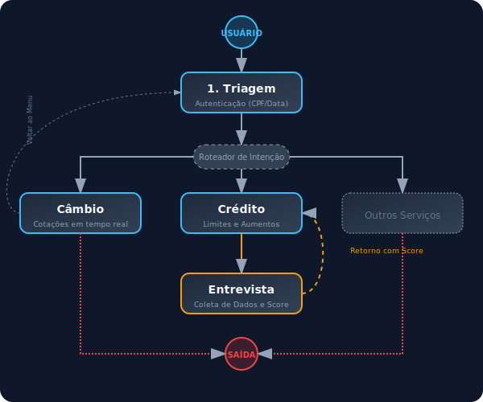

<p align="center">
  
</p>

<p align="center">
  
  
  
  
  
  
</p>

---

## 1. Visão Geral
O **Banco Ágil** é uma plataforma de atendimento bancário baseada em **agentes de inteligência artificial especializados**. Cada agente possui um domínio de competência específico (câmbio, crédito, entrevista de crédito) e opera de forma autônoma dentro do seu escopo, sendo orquestrado por um grafo de estados (LangGraph) que classifica a intenção do cliente e direciona para o especialista adequado.

---

## 2. Arquitetura do Sistema
A arquitetura é baseada no padrão **Multi-Agent Orchestration** utilizando o framework **LangGraph**.

### Agentes e Fluxos
- **Triagem (`triagem`)**: Ponto de entrada. Responsável pela autenticação do cliente e roteamento inicial.
- **Crédito (`credito`)**: Especialista em limites. Consulta dados financeiros e processa pedidos de aumento.
- **Entrevista (`entrevista`)**: Consultor para análise profunda. Coleta dados (renda, emprego, dívidas) para recalcular o score.
- **Câmbio (`cambio`)**: Consultor de moedas estrangeiras com cotações em tempo real.

### Manipulação de Dados
Os dados fluem através de um **Estado Global** (`BancoAgilState`) que persiste o histórico de mensagens, informações do cliente autenticado e o agente ativo. A persistência em produção utiliza o **Supabase** (PostgreSQL) para garantir integridade e escalabilidade.

<p align="center">
  
</p>

---

## 3. Funcionalidades Implementadas
- **Autenticação em Duas Etapas**: Validação de CPF e data de nascimento com limite de tentativas.
- **Roteamento Dinâmico**: Transição entre especialistas baseada em intenção natural (NLP).
- **Cálculo de Score em Tempo Real**: Algoritmo que processa variáveis socioeconômicas para atualização imediata.
- **Cotação Multi-moedas**: Integração com APIs externas para USD, EUR, GBP e BTC.
- **Interface Premium**: Dashboard de chat responsivo com feedback visual de processamento.

---

## 4. Escolhas Técnicas e Justificativas
- **LangGraph**: Escolhido pela capacidade de criar grafos cíclicos, permitindo que o cliente volte ao menu ou mude de assunto a qualquer momento sem perder o contexto.
- **FastAPI**: Utilizado no backend pela performance superior e suporte nativo a streaming SSE (Server-Sent Events), essencial para chats de IA.
- **Supabase**: Proporciona um backend-as-a-service completo com autenticação e banco de dados relacional robusto.
- **React + Tailwind**: Para uma interface de usuário rápida, tipada e com design premium altamente customizável.

---

## 5. Desafios Enfrentados e Resoluções
- **Context Window e Latência**: Conversas longas (especialmente em entrevistas) degradavam a performance. **Resolução**: Implementação de uma camada de gerenciamento de contexto (`trim_messages`) que mantém apenas as mensagens essenciais para a LLM.
- **Alucinações de Handoff**: Os agentes às vezes inventavam serviços ao trocar de contexto. **Resolução**: Implementação de "Regras de Ouro" globais e gatilhos técnicos (`SystemMessages`) que forçam o comportamento estrito de cada especialista no momento da transição.
- **Estabilidade da API**: Erros 502/504 em provedores de LLM. **Resolução**: Implementação de tratamento de exceções no frontend para exibir mensagens amigáveis e permitir o reenvio da mensagem.

---

## 6. Tutorial de Execução e Testes

### Pré-requisitos
- Python 3.10+ | Node.js 18+ | Chave de API (OpenRouter, Groq ou Google)

### Passo a Passo
1. **Clonar e Instalar**:
   ```bash
   git clone https://github.com/gusttavosants/BankChat.git
   cd BankChat/backend && pip install -r requirements.txt
   cd ../frontend && npm install
   ```
2. **Configurar .env**: Crie o arquivo em `backend/.env` com as chaves necessárias.
3. **Rodar o Backend**: `uvicorn api.main:app --reload`
4. **Rodar o Frontend**: `npm run dev`

---
*Desenvolvido por Gustavo Santos como parte do projeto Banco Ágil.*
